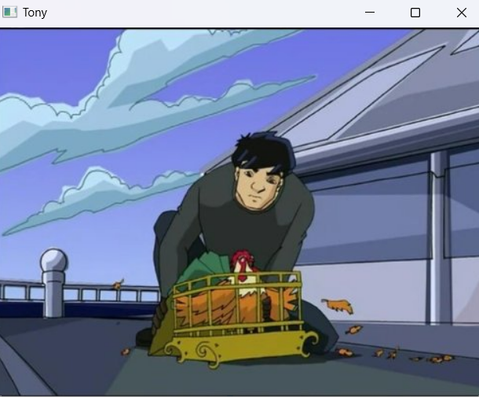
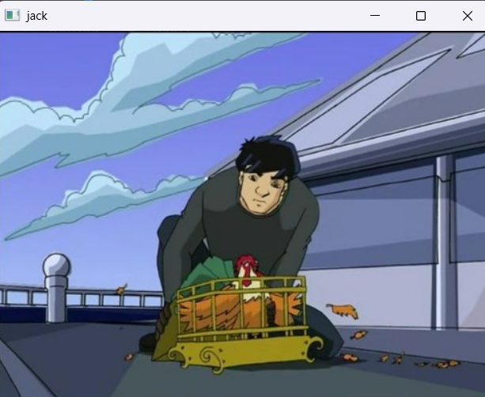
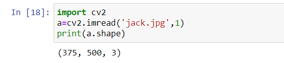
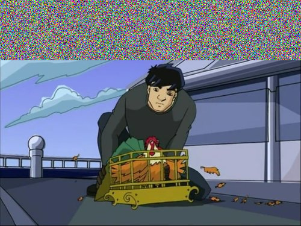
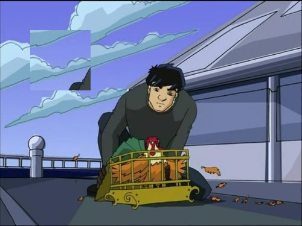

# READ AND WRITE AN IMAGE
## AIM
To write a python program using OpenCV to do the following image manipulations.

i) Read, display, and write an image.

ii) Access the rows and columns in an image.

iii) Cut and paste a small portion of the image.

## Software Required:
Anaconda - Python 3.7
## Algorithm:
### Step1:
Choose an image and save it as a filename.jpg
### Step2:
Use imread(filename, flags) to read the file.
### Step3:
Use imshow(window_name, image) to display the image.
### Step4:
Use imwrite(filename, image) to write the image.
### Step5:
End the program and close the output image windows.
## Program:-
<br>

### Developed By : Sarankumar J
### Register Number: 212221230087
<br>

i) To Read,display the image
```py
  import cv2
  s=cv2.imread('jack.jpg',1)
  cv2.imshow('Tony',s)
  cv2.waitKey(0)
```
ii) To write the image
```py
import cv2
a=cv2.imread('jack.jpg',1)
cv2.imwrite('rj.jpg',a)
cv2.imshow('jack',a)
cv2.waitKey(0)
cv2.destroyAllWindows()
```
iii) Find the shape of the Image
```py
import cv2
a=cv2.imread('jack.jpg',1)
print(a.shape)
```
iv) To access rows and columns

```py
import cv2
a=cv2.imread('jack.jpg',1)
import random
for i in range (100):
    for j in range(a.shape[1]):
        a[i][j] = [random.randint(0,255),random.randint(0,255),random.randint(0,255)]
cv2.imshow('Jackie',a)
cv2.waitKey(0)
cv2.destroyAllWindows()
```
v) To cut and paste portion of image
```py
import cv2
a=cv2.imread('jack.jpg',1)
tag = a[100:200,100:200]
a[50:150,50:150] = tag
cv2.imshow('Image',a)
cv2.waitKey(0)
cv2.destroyAllWindows()
```

## Output:

### i) Read and display the image



### ii) Write the image


### iii) Shape of the Image



### iv) Access rows and columns

### v) Cut and paste portion of image


## Result:
Thus the images are read, displayed, and written successfully using the python program.


